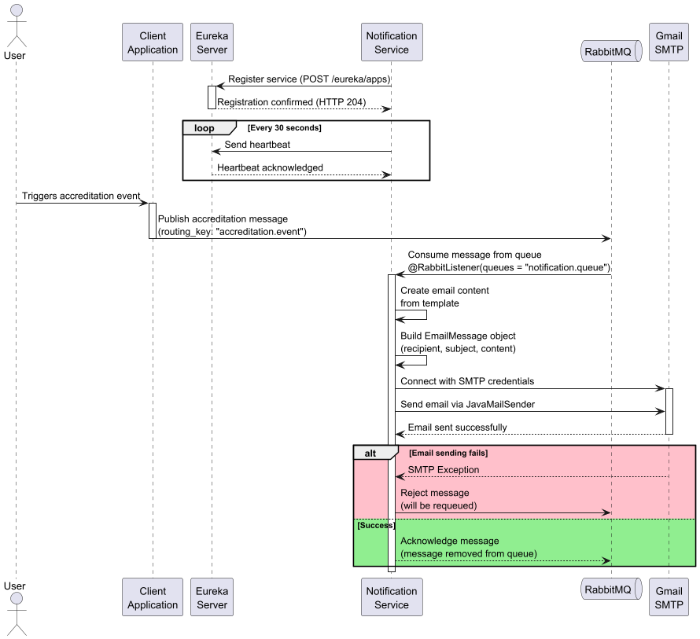
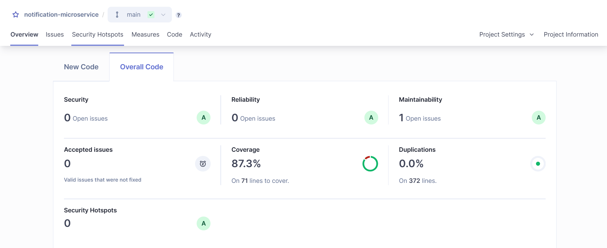

# 📧 Notification Microservice

## 📘 Language Directory

- [English Version](#-notification-microservice-english)
- [Versión en Español](#-microservicio-de-notificaciones-español)

---
## 🧾 Notification Microservice (English)

This microservice is responsible for handling **email notifications** triggered by accreditations. When a user completes an accreditation, this service receives an event from RabbitMQ, generates a PDF receipt, and sends it via email.

---

## 🌐 Overview

- **Language & Framework:** Java 21, Spring Boot 3.4.5
- **Architecture:** Microservice-based, asynchronous communication with RabbitMQ
- **Email Service:** JavaMailSender (SMTP)
- **PDF Generation:** iText 9.0.0
- **Logging & Monitoring:** Jacoco, SonarQube
- **Service Discovery:** Eureka Client
- **Inter-service Communication:** RabbitMQ

---

## 📦 Features

- 📥 Listens to messages on the accreditation queue
- 🧾 Generates a detailed PDF with order information
- 📤 Sends the PDF via email to the user
- 🧪 Includes unit testing with JUnit and Mockito
- ✅ Integrated with SonarQube and Jacoco for code quality
- 📚 Configuration centralized in `application.properties`

---

## 🔁 Workflow Diagram



---

## 🐇 RabbitMQ Configuration

- **Queue:** `accreditation.queue`
- **Exchange:** `accreditation.exchange`
- **Routing Key:** `accreditation.created`
- **Dead Letter Queue:** `accreditation.dlq`
- **TTL:** 20 seconds
- **Bindings:** Configured and declared via Spring Beans in `RabbitConfig.java`

---

## 📨 Email Sending

- Email includes a PDF attachment (`order.pdf`)
- Subject: `Confirmation of your order`
- Content: Simple HTML message
- Errors handled via:
  - `EmailAuthenticationException`
  - `EmailSendingException`
  - `EmailException`

---

## 📄 PDF Receipt

The generated PDF includes:
- Sale Point information
- User details
- Accreditation amount
- Timestamp of the transaction

All formatted in a clean table with a summary footer.

---

### 🐳 Docker or Podman

Ready for deployment on Docker as part of a larger stack (gateway, config-server, etc.). Typically runs alongside Eureka Server and PostgreSQL.

---

### ✅ Testing & Coverage
Coverage is managed by Jacoco and reported to SonarQube. To run tests, create an `application-test.properties` profile with all necessary environment variables and configurations, and ensure you have a SonarQube container or installation. You can generate reports locally with:

```bash
./mvnw clean verify
# See: target/site/jacoco/index.html
```

---

## 📈 Code Quality

- **Jacoco** for test coverage
- **SonarQube** integration via Maven properties



---

## 🌍 Configuration

All necessary variables (SMTP credentials, queue names, routing keys, exchange names) are defined in `application.properties`. This includes:

```properties
server.port=your_port_of_notification_service
eureka.client.service-url.defaultZone=http://localhost:{your_port_of_eureka}/eureka/
eureka.client.register-with-eureka=true
eureka.client.fetch-registry=true 
eureka.instance.prefer-ip-address=true
#Remember that Rabbit's configurations need to match the ones in the accreditation service
spring.rabbitmq.host=your_rabbitmq_host(normally localhost)
spring.rabbitmq.port=your_rabbitmq_port(normally 5672)
spring.rabbitmq.username=your_username
spring.rabbitmq.password=your_password
rabbitmq.queue.accreditation=accreditation.queue
rabbitmq.routingkey.accreditation=accreditation.created
accreditation.exchange=accreditation.exchange
spring.mail.host=smtp.example.com
spring.mail.port=587
spring.mail.username=your_email@example.com
spring.mail.password=your_password
```

---

## 🌐 Multilingual

A full Spanish version of this README is provided below.

---

## 📧 Microservicio de Notificaciones (Español)

Este microservicio se encarga de enviar **correos electrónicos** cuando se crea una acreditación. Escucha eventos en una cola RabbitMQ, genera un recibo en PDF y lo envía al correo del usuario.

## 🌐 Visión General

- **Lenguaje y Framework:** Java 21, Spring Boot 3.4.5
- **Arquitectura:** Microservicio, comunicación asíncrona
- **Correo:** JavaMailSender (SMTP)
- **Generación de PDF:** iText 9.0.0
- **Registro y Calidad:** Jacoco, SonarQube
- **Descubrimiento de Servicios:** Eureka Client
- **Comunicación entre servicios:** RabbitMQ

## 📦 Características

- 📥 Escucha mensajes en la cola de acreditaciones
- 🧾 Genera un PDF detallado
- 📤 Envía el PDF por email
- 🧪 Tests unitarios con JUnit y Mockito
- ✅ Integración con SonarQube y Jacoco
- 📚 Variables centralizadas en `application.properties`

## 🔁 Diagrama de Flujo


## 🐇 Configuración de RabbitMQ

- **Cola:** `accreditation.queue`
- **Exchange:** `accreditation.exchange`
- **Routing Key:** `accreditation.created`
- **Cola de Dead Letter:** `accreditation.dlq`
- **TTL:** 20 segundos
- **Bindings:** Declarados mediante Beans en Spring

## 📨 Envío de Correos

- El correo contiene un PDF adjunto (`order.pdf`)
- Asunto: `Confirmación de su orden`
- Mensaje en HTML simple
- Errores gestionados con excepciones específicas

## 📄 Recibo PDF

El recibo generado incluye:
- Información del punto de venta
- Datos del usuario
- Monto acreditado
- Fecha y hora

---

### 🐳 Docker

Este microservicio está listo para correr en entornos Docker como parte de un stack mayor (gateway, config-server, etc.). Usualmente se ejecuta en conjunto con Eureka Server y una base PostgreSQL.

---

### ✅ Pruebas y Cobertura

La cobertura es gestionada por Jacoco y reportada a SonarQube, por lo que si quieres ejecutar los tests, deberás crear un perfil application-test.properties y
definir todas las variables de entorno y configuraciones, además deberás tener un contenedor de SonarQube o instalarlo. Puedes generar los reportes localmente con:


```bash
./mvnw clean verify
# Ver: target/site/jacoco/index.html
```

---

## 📈 Calidad de Código

- **Jacoco** para cobertura
- **SonarQube** para análisis de calidad


## 🌍 Configuración

Las siguientes variables están en `application.properties` que necesitas definir para los servicios:

```properties
server.port=your_port_of_notification_service
eureka.client.service-url.defaultZone=http://localhost:{your_port_of_eureka}/eureka/
eureka.client.register-with-eureka=true
eureka.client.fetch-registry=true 
eureka.instance.prefer-ip-address=true
#Recuerda que las configuraciones de Rabbit deben coincidir con las del servicio de acreditación
spring.rabbitmq.host=your_rabbitmq_host(normally localhost)
spring.rabbitmq.port=your_rabbitmq_port(normally 5672)
spring.rabbitmq.username=your_username
spring.rabbitmq.password=your_password
rabbitmq.queue.accreditation=accreditation.queue
rabbitmq.routingkey.accreditation=accreditation.created
accreditation.exchange=accreditation.exchange
spring.mail.host=smtp.example.com
spring.mail.port=587
spring.mail.username=tu_correo@example.com
spring.mail.password=tu_contraseña
```
